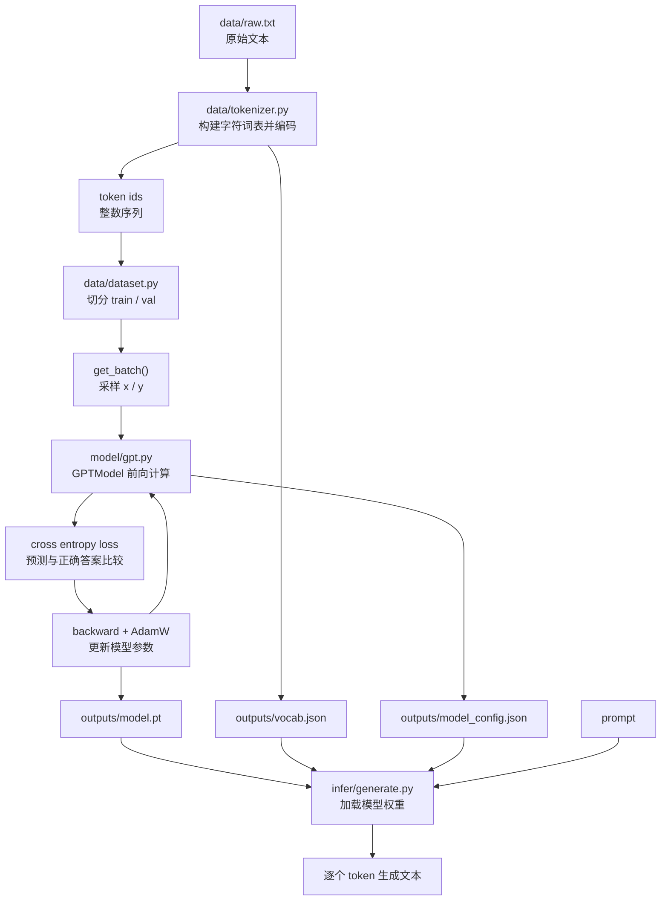

# Mini GPT 学习项目

该项目提供一个面向初学者的最小可运行 GPT（Decoder-only Transformer）实现，包含分词、训练与推理闭环，帮助理解 GPT 的核心原理。

## 先建立直觉

如果你没有机器学习背景，可以先把这个项目理解成一个“文本接龙程序”：

- 输入一段文本，比如 `The`
- 模型猜下一个字符最可能是什么
- 把猜出来的字符接到后面，再继续猜下一个
- 重复很多次，就能生成一整段文本

GPT 的核心任务并不神秘，本质上就是：

- 已知前面的内容
- 预测下一个 token

这里的 `token` 可以是字符、词，或者词的一部分。这个项目为了方便学习，使用的是“字符级 token”，也就是把每个字符都当作一个最小单位，例如：

```text
"Hello" -> ["H", "e", "l", "l", "o"]
```

这样做虽然不够强大，但非常适合入门，因为流程最直接。

## 目录结构

```
mini_gpt/
├─ data/
│  ├─ raw.txt
│  ├─ tokenizer.py
│  └─ dataset.py
├─ model/
│  └─ gpt.py
├─ train/
│  └─ train.py
├─ infer/
│  └─ generate.py
├─ eval/
│  └─ evaluate.py
├─ utils/
│  ├─ config.py
│  └─ seed.py
└─ configs/
   └─ default.yaml
```

## 快速开始

1. 安装依赖

```
uv sync
```

2. 训练

```
uv run -m cli train
```

3. 推理

```
uv run -m cli infer --prompt "Hello"
```

4. 评估

```
uv run -m cli eval
```

可选的模块运行方式：

```
uv run python -m train.train
uv run python -m infer.generate --prompt "Hello"
uv run python -m eval.evaluate
```

如果本地没有 `uv`，可以先进入虚拟环境，再执行 Python 脚本：

```bash
source .venv/bin/activate
python -m cli train
python -m cli infer --prompt "Hello"
python -m cli eval
```

## 零基础需要先知道的几个概念

### 1. 什么是训练

训练就是让模型反复做“预测下一个字符”的练习。

例如一句话：

```text
To be
```

可以拆成很多训练样本：

- 输入 `T`，目标是预测 `o`
- 输入 `To`，目标是预测空格
- 输入 `To `，目标是预测 `b`
- 输入 `To b`，目标是预测 `e`

模型一开始是乱猜的。训练的过程就是：

- 猜一个结果
- 和正确答案比较
- 根据差距微调参数
- 重复很多轮

参数可以简单理解成“模型脑子里的数字记忆”。

### 2. 什么是推理

推理就是训练完成后，真正拿模型来生成文本。

流程是：

- 用户给一个开头 `prompt`
- 模型根据开头预测下一个字符
- 把新字符拼回输入
- 再继续预测

这就是 [infer/generate.py](infer/generate.py) 做的事情。

### 3. 什么是 loss

`loss` 可以理解成“模型答错了多少”。

- `loss` 越大，说明预测得越差
- `loss` 越小，说明预测得越准

训练时我们希望 loss 逐渐下降。这个项目里使用的是交叉熵损失，它是语言模型里最常见的做法。

### 4. 什么是 perplexity

`perplexity` 是由 loss 换算出来的一个指标，可以简单理解成“模型有多困惑”。

- 数值越小越好
- 越小表示模型越确定下一个字符应该是什么

对于这个学习项目，你不必太纠结绝对数值，更重要的是理解它和 loss 一样，都是在衡量模型预测能力。

### 5. 什么是 block_size

`block_size` 表示模型每次最多能看到多长的上下文。

例如 `block_size = 8` 时，模型预测下一个字符时，最多只参考前 8 个字符。更早的内容会被截掉。

你可以把它理解成模型的“短期记忆窗口”。

## 这个项目是怎么工作的

可以把整个流程理解成下面 5 步：

1. 读取原始文本
2. 把文本转成数字 ID
3. 用这些数字训练 GPT 模型
4. 保存训练好的参数和词表
5. 加载模型并继续生成文本

### 训练与推理总览图

下面这张图只描述当前仓库里已经实现的内容，方便先建立整体认识：



如果你只记住一件事，可以记这个：

- 训练阶段是在做“根据前文预测下一个字符”
- 推理阶段是在做“把这个预测过程重复很多次”

### 第 1 步：读取原始文本

[data/raw.txt](data/raw.txt) 是训练语料。项目会先读入这个纯文本文件。

### 第 2 步：把字符变成数字

神经网络不能直接处理字符串，所以要先把字符映射成整数。

比如：

```text
{"T": 8, "o": 22, " ": 1}
```

这件事由 [data/tokenizer.py](data/tokenizer.py) 完成。

- `encode()`：把文本转成 ID 序列
- `decode()`：把 ID 序列还原成文本
- `save()` / `load()`：保存和加载词表

### 第 3 步：切训练样本

[data/dataset.py](data/dataset.py) 会做两件事：

- 按比例切分训练集和验证集
- 随机截取一小段连续文本作为训练样本

例如一段 ID 序列：

```text
[8, 22, 1, 11, 13]
```

可以构造出：

- 输入 `x = [8, 22, 1, 11]`
- 目标 `y = [22, 1, 11, 13]`

也就是“每个位置都去预测右边那个字符”。

### 第 4 步：模型如何预测

[model/gpt.py](model/gpt.py) 是这个项目最核心的文件。

它主要包含 4 层概念：

- `token_emb`：把“字符 ID”变成向量
- `pos_emb`：告诉模型当前位置是第几个字符
- `Block`：反复堆叠的 Transformer 模块
- `lm_head`：把内部向量再投影回词表，输出每个字符的概率分数

其中最重要的是“因果自注意力”：

- 模型在预测当前位置时
- 只能看当前位置以及前面的内容
- 不能偷看未来

这也是 GPT 能做自回归生成的关键。

### 第 5 步：训练时到底更新了什么

[train/train.py](train/train.py) 会不断重复：

1. 取一批训练样本
2. 喂给模型得到预测结果
3. 计算预测和正确答案之间的误差
4. 通过反向传播更新参数

这里最重要但也最容易被神秘化的词有两个：

- 前向传播：输入数据，算出预测结果
- 反向传播：根据误差反过来调整模型参数

如果你完全没接触过机器学习，可以先把它理解成：

- 模型先答题
- 系统告诉它哪里错了
- 它再小幅修正自己

## 每个文件分别适合学什么

- [cli.py](cli.py)：看项目是怎么组织训练、推理、评估入口的
- [data/tokenizer.py](data/tokenizer.py)：理解“文本如何变成数字”
- [data/dataset.py](data/dataset.py)：理解“训练样本是怎么切出来的”
- [model/gpt.py](model/gpt.py)：理解 GPT 主体结构
- [train/train.py](train/train.py)：理解训练循环
- [infer/generate.py](infer/generate.py)：理解模型怎么一步步生成文本
- [eval/evaluate.py](eval/evaluate.py)：理解验证集评估
- [configs/default.yaml](configs/default.yaml)：理解超参数都有哪些

## 建议的学习顺序

如果你是第一次接触这类项目，推荐按这个顺序读：

1. 先看 [data/tokenizer.py](data/tokenizer.py)
2. 再看 [data/dataset.py](data/dataset.py)
3. 然后看 [model/gpt.py](model/gpt.py)
4. 最后看 [train/train.py](train/train.py) 和 [infer/generate.py](infer/generate.py)

原因很简单：

- 先理解“数据长什么样”
- 再理解“模型怎么处理数据”
- 最后理解“模型怎么被训练起来”

## 可以先不用深究的东西

第一次学习时，不需要一上来就搞懂下面这些：

- 为什么注意力公式里要除以 `sqrt(d)`
- 为什么 LayerNorm 能稳定训练
- 为什么 MLP 要先升维再降维
- 为什么 top-k、top-p 会影响生成风格

先接受它们“能工作”，把整体链路跑通，再逐个深入，学习体验会轻松很多。

## 项目架构

**流程概览**

- raw.txt 文本 → CharTokenizer 构建词表
- dataset 切分 train/val 并按 block_size 采样
- GPTModel 训练并保存 model.pt、model_config.json、vocab.json
- 推理加载保存的配置与词表进行生成
- 评估在验证集上计算 loss 与 perplexity

**核心模块**

- data/tokenizer.py：字符级分词与词表保存加载
- data/dataset.py：数据切分与批量采样
- model/gpt.py：GPT 结构（注意力、MLP、Block、GPTModel）
- train/train.py：训练入口与模型保存
- infer/generate.py：推理入口与采样生成
- eval/evaluate.py：评估入口与指标计算
- utils/config.py：配置读取与合并
- utils/seed.py：随机种子设置

## 说明

- 默认使用字符级分词
- 数据集示例为 data/raw.txt，可替换为任意纯文本
- 若语料较短，训练会自动缩小 block_size
- 推理默认读取训练时保存的 model_config.json，避免参数不一致
- 推理 prompt 必须由训练词表中的字符组成
